Data visualization practice
================
Table of Contents

- <a href="#hw1-line-and-scatter-plots"
  id="toc-hw1-line-and-scatter-plots">HW1: line and scatter plots</a>
- <a href="#hw2-bar-plots" id="toc-hw2-bar-plots">HW2: bar plots</a>
- <a href="#hw3-bar-and-scatter-plots"
  id="toc-hw3-bar-and-scatter-plots">HW3: bar and scatter plots</a>
- <a href="#hw4-strip-box-and-ridgeline-charts"
  id="toc-hw4-strip-box-and-ridgeline-charts">HW4: strip, box, and
  ridgeline charts</a>
- <a href="#hw5-data-wrangling-and-line-plots"
  id="toc-hw5-data-wrangling-and-line-plots">HW5: data wrangling and line
  plots</a>
- <a href="#hw6-data-wrangling-and-pie-charts"
  id="toc-hw6-data-wrangling-and-pie-charts">HW6: data wrangling and pie
  charts</a>
- <a href="#hw7-colorspace-and-theme-customizations"
  id="toc-hw7-colorspace-and-theme-customizations">HW7:
  <code>colorspace</code> and theme customizations</a>
- <a href="#hw8-time-series-and-tidy-linear-models"
  id="toc-hw8-time-series-and-tidy-linear-models">HW8: time series and
  (tidy) linear models</a>
- <a href="#hw9-principal-component-analysis"
  id="toc-hw9-principal-component-analysis">HW9: principal component
  analysis</a>

# HW1: line and scatter plots

## Q1

The `economics` dataset contains various time series data from the US
economy. Use ggplot to make a line plot of the total population (`pop`,
in thousands) versus time (column `date`).

``` r
ggplot(economics) +
  geom_line(aes(x = date, y = pop)) +
  labs(
    x = 'Year',
    title = 'U.S. Population Size Over Time'
    ) +
  scale_y_continuous(
    'Population (Thousands)',
    labels =  scales::comma
    ) +
  theme_minimal() +
  theme(plot.title = element_text(hjust = 0.5)) 
```

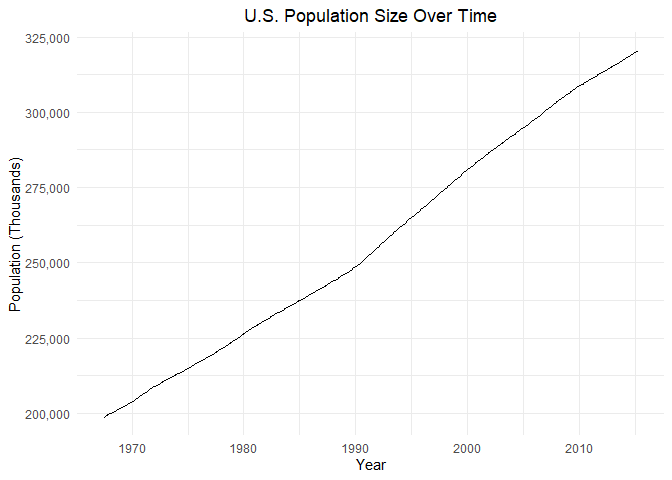<!-- -->

## Q2

Again using the `economics` dataset, now make a scatter plot of the
number of unemployed versus the total population, and color points by
date.

``` r
ggplot(economics) +
  geom_point(
    aes(x = pop, y = unemploy, col = date)
    ) +
  scale_y_continuous(
    'Number of Unemployed (Thousands)',
    labels =  scales::comma
    ) +
  scale_x_continuous(
    'Population (Thousands)',
    labels =  scales::comma
    ) +
  labs(
    col = 'Year',
    title = 'Unemployment Ratio Over Time'
    ) +
  theme_minimal() +
  theme(plot.title = element_text(hjust = 0.5))
```

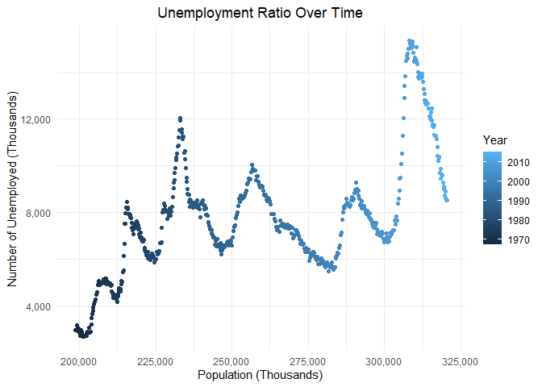<!-- -->

# HW2: bar plots

We will work with the dataset `txhouse` that has been derived from the
`txhousing` dataset provided by **ggplot2**. See here for details of the
original dataset:
<https://ggplot2.tidyverse.org/reference/txhousing.html>. `txhouse`
contains three columns: `city` (containing four Texas cities), `year`
(containing four years between 2000 and 2015) and `total_sales`
indicating the total number of sales for the specified year and city.

``` r
# data prep:
txhouse = txhousing %>%
  filter(city %in% c('Austin', 'Houston', 'San Antonio', 'Dallas')) %>%
  filter(year %in% c('2000', '2005', '2010', '2015')) %>%
  group_by(city, year) %>%
  summarize(total_sales = sum(sales))
```

## Q1

Use ggplot to make a bar plot of the total housing sales (column
`total_sales`) for each `city` and show one panel per `year`.

``` r
ggplot(txhouse) +
  geom_col(
    aes(
      x = total_sales,
      y = fct_reorder(city, total_sales)
      )
    ) +
  facet_wrap(~year, nrow = 1) +
  labs(
    y = '',
    title = 'Texas Real Estate Sales Across the 2000s'
    ) +
  scale_x_continuous(
    name = "Number of sales",
    label = scales::unit_format(unit = "K", scale = 0.001, sep = "")
    ) +
  theme(plot.title = element_text(hjust = 0.5)) 
```

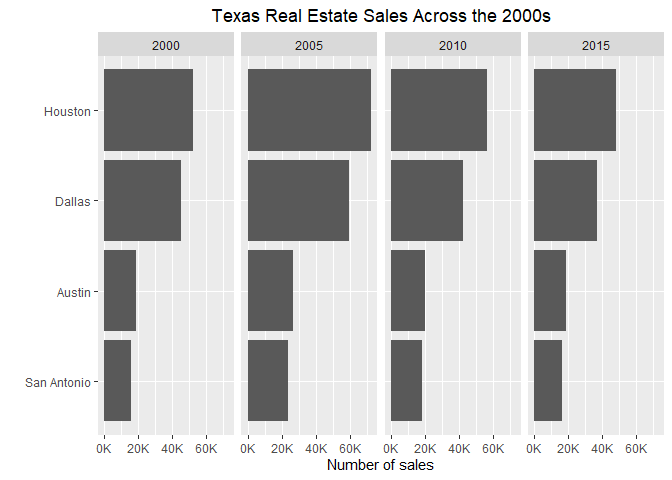<!-- -->

## Q2

Use ggplot to make a bar plot of the total housing sales (column
`total_sales`) for each `year`. Color the bar borders with color
`"gray20"` and assign a fill color based on the `city` column.

``` r
ggplot(txhouse) +
  geom_col(
    aes(
      x = year,
      y = total_sales,
      fill = city
      ),
    col = "gray20"
    ) +
  labs(
    fill = 'City',
    x = 'Year',
    title = 'Texas Real Estate Sales Across the 2000s'
    ) +  
  scale_y_continuous(
    name = 'Number of sales',
    label = scales::unit_format(unit = "K", scale = 0.001, sep = "")
    ) +
  scale_fill_viridis_d() +
  theme_minimal() +
  theme(plot.title = element_text(hjust = 0.5)) 
```

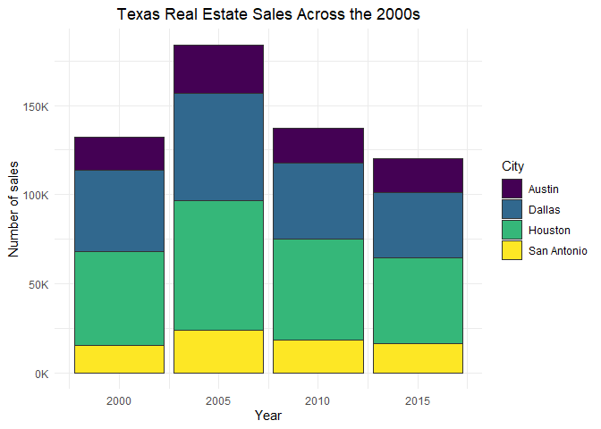<!-- -->

## Q3

Modify the plot from Problem 2 by placing the bars for each city
side-by-side rather than stacked. Next, reorder the bars for each `year`
by `total_sales` in descending order.

``` r
ggplot(txhouse) +
  geom_col(
    aes(
      x = year,
      y = total_sales,
      fill = fct_reorder(city, -total_sales)
      ),
    position = "dodge",
    col = "gray20"
    ) +
  labs(
    fill = 'City',
    x = 'Year',
    title = 'Texas Real Estate Sales Across the 2000s'
    ) +  
  scale_y_continuous(
    name = 'Number of sales',
    label = scales::unit_format(unit = "K", scale = 0.001, sep = "")
    ) +
  scale_fill_viridis_d() +
  theme_minimal() +
  theme(plot.title = element_text(hjust = 0.5)) 
```

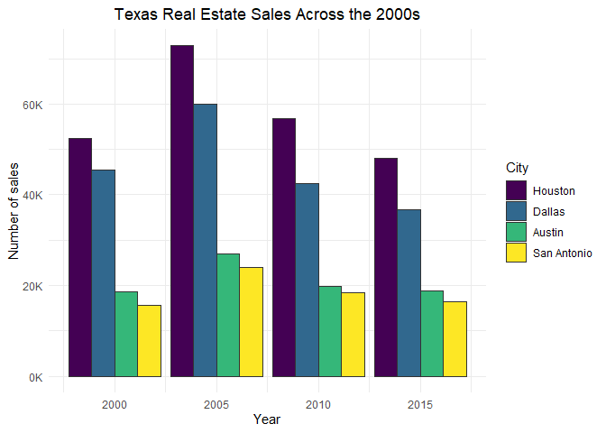<!-- -->

# HW3: bar and scatter plots

## Q1

For problem 1, we will work with the `diamonds` dataset.

1)  Use ggplot to make a bar plot of the total diamond count per `color`
    and show the proportion of each `cut` within each `color` category.

2)  In two sentences, explain when to use `geom_bar()` instead of
    `geom_col()`. Which of these functions requires only an `x` or `y`
    variable?

`geom_bar()` should be used to represent counts of binned/grouped data.
As a result, this function only requires an `x` input, since the
function internally calls `stat_count()` to plot counts on the `y` axis.

Alternatively, `geom_col()` is used to represent binned/categorical `x`
values with their corresponding `y` values. As a result, this function
is not representative of proportionality like `geom_bar()` is.

``` r
ggplot(diamonds) +
  geom_bar(
    aes(x = color, fill = cut), 
    alpha = 0.8
    ) +
  scale_y_continuous(
    name = 'Count',
    labels = scales::label_comma()) +
  labs(
    x = 'Color', 
    title = 'Variation in Diamond Cut by Color'
    ) +
  scale_fill_brewer('Cut') +
  theme_minimal() +
  theme(plot.title = element_text(hjust = 0.5)) 
```

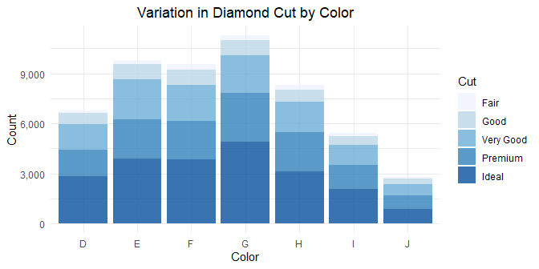

## Q2

For problem 2 and 3, we will work with the dataset `OH_pop` that
contains Ohio state demographics and has been derived from the `midwest`
dataset provided by **ggplot2**. `OH_pop` contains two columns: `county`
and `poptotal` (the county’s total population), and it only contains
counties with at least 100,000 inhabitants.

``` r
# data prep:
OH_pop = midwest %>%
  filter(state == "OH") %>%
  arrange(desc(poptotal)) %>%
  mutate(row = row_number()) %>%
  filter(poptotal >= 100000) %>%
  select(c(county, poptotal))
```

1)  Use ggplot to make a scatter plot of `county` vs total population
    (column `poptotal`) and order the counties by increasing population.

2)  Rename the axes and set appropriate limits, breaks and labels.

``` r
ggplot(OH_pop) +
  geom_point(aes(poptotal, reorder(county, poptotal))) +
  scale_x_continuous(
    breaks = seq(100000, 1400000, 200000),
    labels = scales::label_comma(scale = 0.001, suffix = 'K')
    ) +
  scale_y_discrete() +
  labs(
    x = 'Population Size',
    y = 'County',
    title = 'Population Size of Ohio Counties',
    subtitle = 'Note: data only represents counties with at least 100K inhabitants.'
  )
```

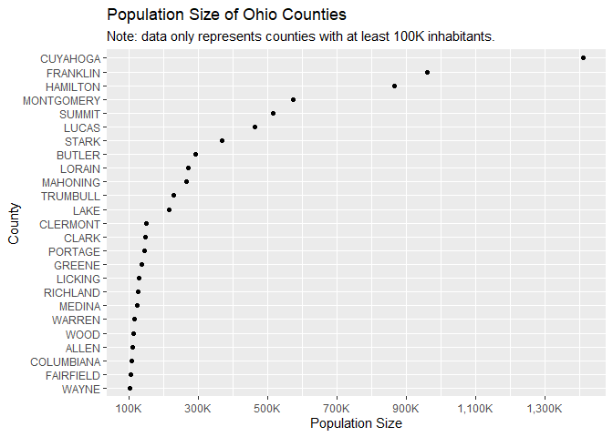

## Q3

1)  Modify the plot from Problem 2 by changing the scale for `poptotal`
    to logarithmic.

2)  Adjust the limits, breaks and labels for the logarithmic scale.

``` r
ggplot(OH_pop) +
  geom_point(aes(poptotal, reorder(county, poptotal))) +
  scale_x_log10(
    breaks = seq(100000, 1500000, 200000),
    label = scales::label_comma(scale = 0.001, suffix = 'K')
    ) +
  scale_y_discrete() +
  theme(axis.text.x = element_text(angle = 315, vjust = -0.3)) +
  labs(
    x = 'Population Size',
    y = 'County',
    title = 'Population Size of Ohio Counties',
    subtitle = 'Note: data only represents counties with at least 100K inhabitants.'
  )
```

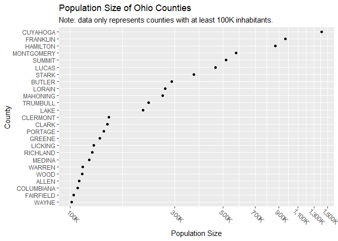

# HW4: strip, box, and ridgeline charts

## Q1

We will work with the `mpg` data set provided by **ggplot2**.

Make two different strip charts of highway fuel economy (`hwy`) versus
number of cylinders (`cyl`), the first one without horizontal jitter and
second one with horizontal jitter. In both plots, please replace names
of the data columns (`hwy`, `cyl`) along the axes with nice, easily
readable labels.

Explain in 1-2 sentences why the plot without jitter is misleading:

*For discrete categories such as number of cylinders, a strip chart
without jitter will often result in overlapping points with identical
y-values. These overlapping points make it difficult to identify
y-values that are densely populated, even after changing transparency.
As a result, horizontal jittering is an effective way to display
multiple y-values within the same discrete category.*

``` r
# Define base layer of plot
base_plot = mpg %>% 
  ggplot(aes(x = cyl, y = hwy)) +
  labs(
    x = 'Number of Cylinders',
    y = 'Highway Miles Per Gallon'
    ) +
  theme_minimal() +
  theme(plot.subtitle = element_text(face = 'italic', hjust = 0.5)) +
  background_grid(minor = 'none')
  
# Plot without jitter
no_jitter = base_plot +
  geom_point(
    alpha = 0.5, shape = 16
    ) +
  labs(subtitle = 'No jitter:') 

# Plot with jitter 
jitter = base_plot +
  geom_point(
    alpha = 0.5, shape = 16,
    position = position_jitter(width = 0.2, height = 0)
    ) +
  labs(subtitle = 'With jitter:') 

# Combine two plots onto one row
combined = plot_grid(no_jitter, jitter)

# Define a title for the combined figure
title = ggdraw() +
  draw_label(
    'Effect of Cylinders on Highway Fuel Economy',
     hjust = 0.5, fontface = 'bold'
    )

# Add title to combined figure
plot_grid(
  title, 
  combined,
  ncol = 1, 
  rel_heights = c(0.1, 1)
  )
```

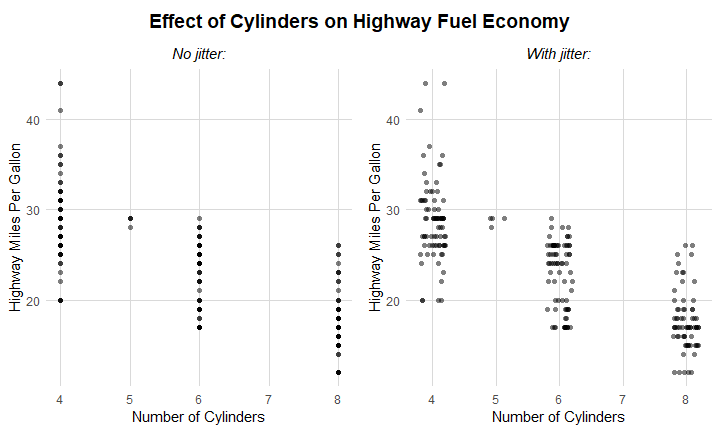

## Q2

For this problem, we will continue working with the `mpg` data set.
Visualize the distribution of each car’s city fuel economy by class
(`class`) and type of drive train (`drv`) with (i) boxplots and (ii)
ridgelines. Make one plot per geom and do not use faceting. In both
cases, put city mpg on the x axis and class on the y axis. Use color to
indicate the car’s drive train. As in Problem 1, rename the axis labels.

The boxplot ggplot generates will have a problem. Describe what the
problem is.

*The box plots have inconsistent widths, which may be misleading to
viewers, since widths do not convey information in box plots.*

``` r
# Clean drive train labels
mpg$drv = gsub('4$', '4WD', mpg$drv)
mpg$drv = gsub('f', 'FWD', mpg$drv)
mpg$drv = gsub('r', 'RWD', mpg$drv)

# Define base plot
base2_plot = mpg %>%
  ggplot(aes(x = cty, y = class, fill = drv)) +
  labs(
    x = 'City Miles Per Gallon',
    y = 'Class',
    fill = 'Drive Train'
    ) +
  scale_x_continuous(
    limits = c(min(mpg$cty), max(mpg$cty))
    ) +
  theme_minimal()

# Box plot
box = base2_plot +
  geom_boxplot() +
  theme(legend.position = 'none')

# Ridgeline of densities
ridge = base2_plot +
  # Color set to drive train here to remove harsh black outline
  geom_density_ridges(scale = 1, alpha = 0.8, rel_min_height = 0.01) +
  theme(legend.position = 'bottom')

# Combine two plots onto one row
combined = plot_grid(box, ridge, nrow = 2)

# Define a title for the combined figure
title = ggdraw() +
  draw_label(
    'Variation in City Fuel Economy by Car Class and Drive Train',
    hjust = 0.5, fontface = 'bold'
    )

# Add title to combined figure
plot_grid(
  title, 
  combined,
  ncol = 1, 
  rel_heights = c(0.1, 1)
  )
```

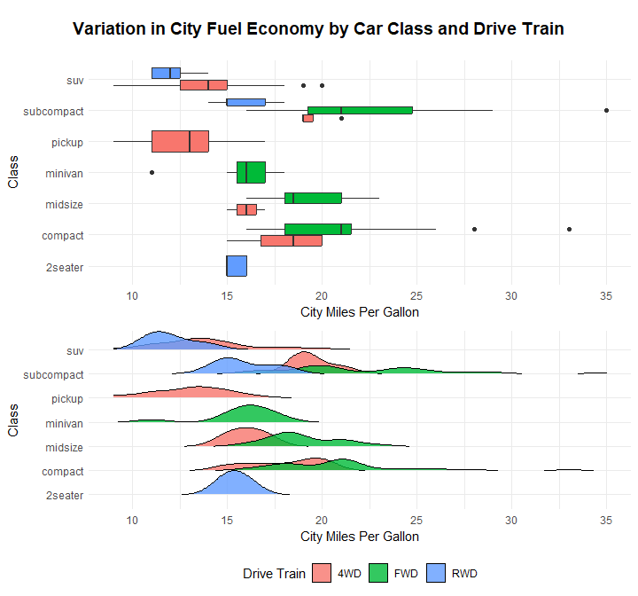

# HW5: data wrangling and line plots

## Q1

We will work with the `ufo_sightings` dataset.

``` r
# data prep:
ufo_sightings = read_csv("https://wilkelab.org/classes/SDS348/data_sets/ufo_sightings_clean.csv") %>%
  separate(datetime, into = c("month", "day", "year"), sep = "/") %>%
  separate(year, into = c("year", "time"), sep = " ") %>%
  separate(date_posted, into = c("month_posted", "day_posted", "year_posted"), sep = "/") %>%
  select(-time, -month_posted, -day_posted) %>%
  mutate(
    year = as.numeric(year),
    state = toupper(state)
  ) %>%
  filter(!is.na(country))
```

Since 2000 (inclusive), what are the top 10 cities that have reported
the most UFO sightings? Create a new dataframe to answer the question.
No plots are necessary.

``` r
ufo_sightings %>% 
  filter(year >= 2000) %>%
  group_by(city) %>%
  summarise(sighting_count = n()) %>%
  arrange(-sighting_count) %>%
  slice(1:10) %>%
  kable()
```

<table>
<thead>
<tr>
<th style="text-align:left;">
city
</th>
<th style="text-align:right;">
sighting_count
</th>
</tr>
</thead>
<tbody>
<tr>
<td style="text-align:left;">
seattle
</td>
<td style="text-align:right;">
406
</td>
</tr>
<tr>
<td style="text-align:left;">
phoenix
</td>
<td style="text-align:right;">
360
</td>
</tr>
<tr>
<td style="text-align:left;">
portland
</td>
<td style="text-align:right;">
314
</td>
</tr>
<tr>
<td style="text-align:left;">
las vegas
</td>
<td style="text-align:right;">
303
</td>
</tr>
<tr>
<td style="text-align:left;">
los angeles
</td>
<td style="text-align:right;">
294
</td>
</tr>
<tr>
<td style="text-align:left;">
san diego
</td>
<td style="text-align:right;">
279
</td>
</tr>
<tr>
<td style="text-align:left;">
houston
</td>
<td style="text-align:right;">
224
</td>
</tr>
<tr>
<td style="text-align:left;">
chicago
</td>
<td style="text-align:right;">
218
</td>
</tr>
<tr>
<td style="text-align:left;">
miami
</td>
<td style="text-align:right;">
198
</td>
</tr>
<tr>
<td style="text-align:left;">
tucson
</td>
<td style="text-align:right;">
196
</td>
</tr>
</tbody>
</table>

## Q2

Next, how has the number of UFO sightings changed for five states since
1940? Your final table should be in long format and have three columns,
`year`, `state`, and `count`. You will plot this table in Problem 3.
Please follow these steps:

1.  Filter the dataset to keep the following five states: AZ, IL, NM,
    OR, WA
2.  Keep only the records from 1940 and onwards.
3.  Find the number of records for each year and state.
4.  Output the head of the new table below your code block.

``` r
keep_states = c('AZ', 'IL', 'NM', 'OR', 'WA')
ufo_filtered_states = ufo_sightings %>% 
  filter(year >= 1940) %>% 
  filter(state %in% keep_states) %>%
  select(year, state) %>%
  group_by(year, state) %>%
  summarise(count = n()) %>%
  arrange(state)

ufo_filtered_states %>% head() %>% kable()
```

<table>
<thead>
<tr>
<th style="text-align:right;">
year
</th>
<th style="text-align:left;">
state
</th>
<th style="text-align:right;">
count
</th>
</tr>
</thead>
<tbody>
<tr>
<td style="text-align:right;">
1946
</td>
<td style="text-align:left;">
AZ
</td>
<td style="text-align:right;">
1
</td>
</tr>
<tr>
<td style="text-align:right;">
1959
</td>
<td style="text-align:left;">
AZ
</td>
<td style="text-align:right;">
2
</td>
</tr>
<tr>
<td style="text-align:right;">
1960
</td>
<td style="text-align:left;">
AZ
</td>
<td style="text-align:right;">
1
</td>
</tr>
<tr>
<td style="text-align:right;">
1963
</td>
<td style="text-align:left;">
AZ
</td>
<td style="text-align:right;">
2
</td>
</tr>
<tr>
<td style="text-align:right;">
1964
</td>
<td style="text-align:left;">
AZ
</td>
<td style="text-align:right;">
1
</td>
</tr>
<tr>
<td style="text-align:right;">
1966
</td>
<td style="text-align:left;">
AZ
</td>
<td style="text-align:right;">
1
</td>
</tr>
</tbody>
</table>

## Q3

Use the new dataframe you made in Problem 2 and add an appropriate color
scale from the `colorspace` package to the plot below.

``` r
ufo_filtered_states %>%
  ggplot() +
  geom_line(
    aes(x = year, y = count, color = state),
    alpha = 0.7,
    size = 1.2
    ) +
  labs(
    x = 'Year',
    y = 'UFO Sightings (Count)',
    title = 'Increased UFO Sightings Since 1940s'
    ) +
  theme_minimal() +
  scale_color_discrete_qualitative(palette = "Dark 2") +
  scale_x_continuous(breaks = seq(1940, 2020, 10)) +
  theme(plot.title = element_text(hjust = 0.5))
```

    ## Warning: Using `size` aesthetic for lines was deprecated in ggplot2 3.4.0.
    ## ℹ Please use `linewidth` instead.

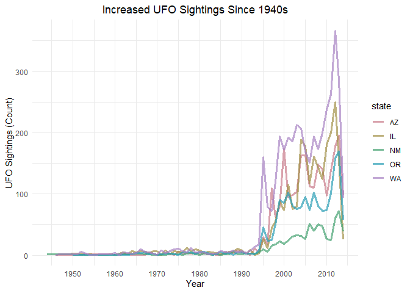<!-- -->

# HW6: data wrangling and pie charts

We will work with the data set `olympics_2002` that contains the count
of all athletes by sex for the 2002 Winter Olympics in Salt Lake City.
It has been derived from the `olympics` data set, which is described
[here](https://github.com/rfordatascience/tidytuesday/blob/master/data/2021/2021-07-27/readme.md).

``` r
# data prep:
olympics = readr::read_csv('https://raw.githubusercontent.com/rfordatascience/tidytuesday/master/data/2021/2021-07-27/olympics.csv')
olympics_2002 <- olympics %>%
  filter(year == 2002, season == "Winter") %>%
  select(sex) %>%
  count(sex) %>%
  pivot_wider(names_from = sex, values_from = n)
```

## Q1

Follow these steps and display the modified dataframe after each step:

1.  Rearrange the dataframe into long form. The resulting dataframe will
    have two columns, which you should call `sex` and `count`. There
    will be two rows of data, one for female and one for male athletes.

    ``` r
    long = olympics_2002 %>%
      pivot_longer(1:2, names_to = 'sex', values_to = 'count') 

    long %>% kable()
    ```

    <table>
    <thead>
    <tr>
    <th style="text-align:left;">

    sex

    </th>
    <th style="text-align:right;">

    count

    </th>
    </tr>
    </thead>
    <tbody>
    <tr>
    <td style="text-align:left;">

    F

    </td>
    <td style="text-align:right;">

    1582

    </td>
    </tr>
    <tr>
    <td style="text-align:left;">

    M

    </td>
    <td style="text-align:right;">

    2527

    </td>
    </tr>
    </tbody>
    </table>

2.  Create a new column with the percent for each `sex.`

    ``` r
    long_pct = long %>%
      mutate(percent = round(count/sum(count), 3)*100)

    long_pct %>% kable()
    ```

    <table>
    <thead>
    <tr>
    <th style="text-align:left;">

    sex

    </th>
    <th style="text-align:right;">

    count

    </th>
    <th style="text-align:right;">

    percent

    </th>
    </tr>
    </thead>
    <tbody>
    <tr>
    <td style="text-align:left;">

    F

    </td>
    <td style="text-align:right;">

    1582

    </td>
    <td style="text-align:right;">

    38.5

    </td>
    </tr>
    <tr>
    <td style="text-align:left;">

    M

    </td>
    <td style="text-align:right;">

    2527

    </td>
    <td style="text-align:right;">

    61.5

    </td>
    </tr>
    </tbody>
    </table>

3.  Rename the values in `sex` to “Female” and “Male”.

    ``` r
    olympics_2002_clean = long_pct %>%
        mutate(sex = case_when(
          sex == 'F' ~ 'Female',
          sex == 'M' ~ 'Male'
          )
        )
    olympics_2002_clean %>% kable()
    ```

    <table>
    <thead>
    <tr>
    <th style="text-align:left;">

    sex

    </th>
    <th style="text-align:right;">

    count

    </th>
    <th style="text-align:right;">

    percent

    </th>
    </tr>
    </thead>
    <tbody>
    <tr>
    <td style="text-align:left;">

    Female

    </td>
    <td style="text-align:right;">

    1582

    </td>
    <td style="text-align:right;">

    38.5

    </td>
    </tr>
    <tr>
    <td style="text-align:left;">

    Male

    </td>
    <td style="text-align:right;">

    2527

    </td>
    <td style="text-align:right;">

    61.5

    </td>
    </tr>
    </tbody>
    </table>

## Q2

Now make a pie chart of the dataset you generated in Problem 1.

``` r
# Clean labels
female_stat = paste0(olympics_2002_clean$percent[1], '%')
male_stat = paste0(olympics_2002_clean$percent[2], '%')
total_athletes = paste0('Based on ', sum(olympics_2002_clean$count), ' total athletes')

olympics_2002_clean %>%
  ggplot(aes(x = percent, y = '', fill = sex)) +
  geom_col(alpha = 0.9) +
  scale_fill_manual(
    values = c('#D55E00', '#0072B2'), 
    breaks = c('Female', 'Male')
    ) +
  coord_polar() +
  theme_void() +
  geom_text(
    aes(x = 80, y = 1, fontface = 2),
    col = 'white',
    label = female_stat
  ) +
  geom_text(
    aes(x = 30, y = 1, fontface = 2),
    col = 'white',
    label = male_stat
  ) +
  labs(
    title = 'Composition of 2002 Winter Olympic Athletes',
    subtitle = total_athletes,
    fill = 'Sex'
    ) +
  theme(plot.subtitle = element_text(face = 'italic'))
```

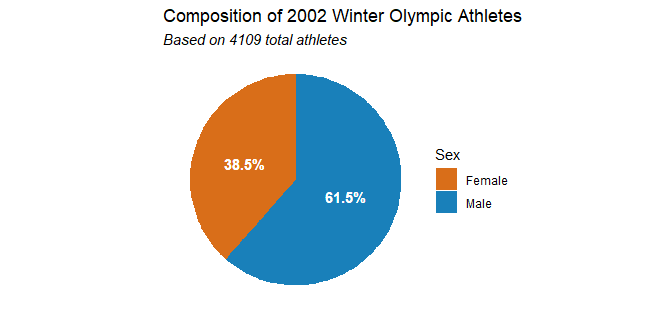<!-- -->

# HW7: `colorspace` and theme customizations

## Q1

Use the color picker app from the **colorspace** package
(`colorspace::choose_color()`) to create a qualitative color scale
containing four colors. One of the four colors should be `#A23C42`, so
you need to find three additional colors that go with this one. Use the
function `swatchplot()` to plot your colors. `swatchplot()` takes in a
vector of colors.

``` r
my_palette = c('#A23C42', '#F2C265', '#607665', '#36364F')
swatchplot(my_palette)
```

<!-- -->

## Q2

For this problem, we will work with the `midwest2` dataset (derived from
`midwest`).

``` r
#data prep:
midwest2 = midwest %>%
  filter(state != "IN")
```

In the following plot, you may notice that the axis tick labels are
smaller than the axis titles, and also in a different color (gray
instead of black).

1.  Use the colors you chose in Problem 1 to color the points.
2.  Make the axis tick labels the same size (`size = 12`) and give them
    the color black (`color = "black"`)
3.  Set the entire plot background to the color `"#FEF8F0"`. Make sure
    there are no white areas remaining, such as behind the plot panel or
    under the legend.

``` r
midwest2 %>%
ggplot() +
  geom_point(
    aes(
      popdensity, 
      percollege, 
      fill = state
      ),
    shape = 21, 
    size = 3, 
    color = "black", 
    stroke = 0.1
    ) +
  scale_x_log10() +
  scale_y_continuous() +
  scale_fill_manual(values = my_palette) +
  labs(
    x = 'Population density',
    y = 'Percent college educated',
    title = 'Effect of population density on college education'
  ) +
  theme_classic(12) +
  theme(
    axis.text = element_text(size = 12, color = 'black'),
    plot.background = element_rect(fill = '#FEF8F0', color = '#FEF8F0'),
    panel.background = element_rect(fill = '#FEF8F0'),
    legend.background = element_rect(fill = '#FEF8F0'),
    plot.title = element_text(hjust = 0.5)
  )
```

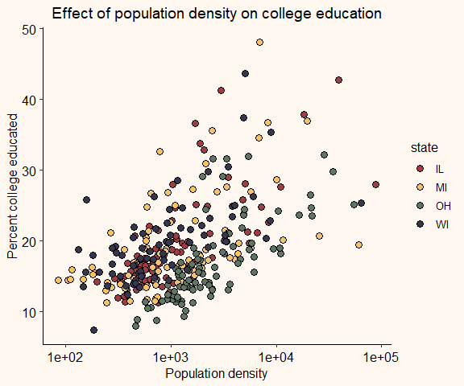<!-- -->

## Q3

For this problem, we will work with the `oceanbuoys` dataset from the
`naniar` library that contains west pacific tropical atmosphere ocean
data for 1993 and 1997.

``` r
#data prep:
oceanbuoys$year = factor(oceanbuoys$year)
oceanbuoys = na.omit(oceanbuoys)
```

Write a function that converts temperature from Celsius to Fahrenheit.
Then, use this function and any other data wrangling code you learned in
class to make a summary table of average sea temperature and air
temperature (in Fahrenheit) for each year in the dataset. The formula
for converting Celsius to Fahrenheit is
`Fahrenheit = (Celsius*1.8) + 32`.

``` r
cel_to_far = function(temp_c){
  temp_f = 32 + (temp_c*1.8)
  return(temp_f)
}

oceanbuoys %>%
  mutate(
    sea_temp_f = cel_to_far(sea_temp_c),
    air_temp_f = cel_to_far(air_temp_c)
  ) %>%
  select(1, 9, 10) %>%
  group_by(year) %>%
  summarize(
    avg_sea_temp_f = round(mean(sea_temp_f, na.rm = T), 2),
    avg_air_temp_f = round(mean(air_temp_f, na.rm = T), 2)
    ) %>% 
  kable()
```

<table>
<thead>
<tr>
<th style="text-align:left;">
year
</th>
<th style="text-align:right;">
avg_sea_temp_f
</th>
<th style="text-align:right;">
avg_air_temp_f
</th>
</tr>
</thead>
<tbody>
<tr>
<td style="text-align:left;">
1993
</td>
<td style="text-align:right;">
74.45
</td>
<td style="text-align:right;">
74.24
</td>
</tr>
<tr>
<td style="text-align:left;">
1997
</td>
<td style="text-align:right;">
82.56
</td>
<td style="text-align:right;">
80.80
</td>
</tr>
</tbody>
</table>

# HW8: time series and (tidy) linear models

The dataset `BA_degrees` contains information about the proportion of
different degrees students receive, as a function of time.

``` r
#data prep:
BA_degrees = read_csv("https://wilkelab.org/SDS375/datasets/BA_degrees.csv")
```

## Q1

Create a subset of the `BA_degrees` dataset that only considers the
degree fields “Business”, “Education”, and “Psychology”. Then make a
single plot that satisfies these three criteria:

1)  Plot a time series of the proportion of degrees (column `perc`) in
    each field over time and create a separate panel per degree field.
2)  Add a straight line fit to each panel.
3)  Order the panels by the difference between the maximum and the
    minimum proportion (i.e., the range of the data).

``` r
subset_fields = c('Business', 'Education', 'Psychology')
BA_degrees %>%
  filter(field %in% subset_fields) %>%
  group_by(field) %>%
  mutate(
    range = abs(max(perc) - min(perc))
    ) %>%
  ggplot(aes(x = year, y = perc)) +
  geom_point(col = 'dark grey') +
  geom_smooth(
    formula = y ~ x, 
    method = 'lm'
    ) +
  facet_wrap(
    vars(reorder(field, -range))
    ) +
  labs(
    x = '', 
    y = 'Proportion',
    title = 'Degree Popularity into the 21st century'
    ) +
  theme(
    panel.background = element_rect(fill = 'white'),
    axis.line = element_line(color = 'grey'),
    panel.grid = element_line(color = '#ececec'),
    plot.title = element_text(hjust = 0.5)
    )
```

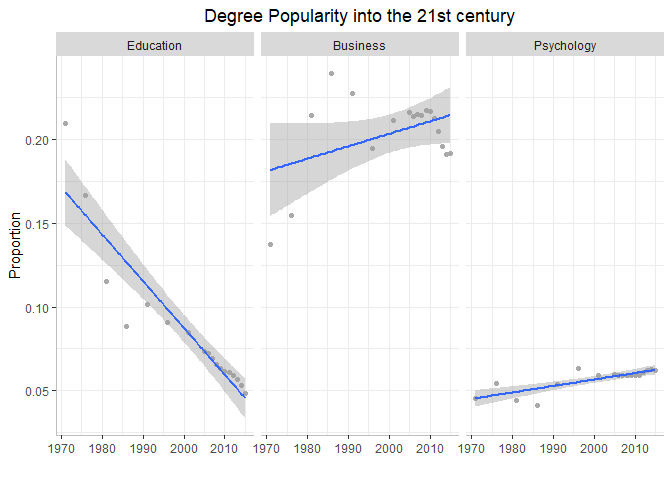<!-- -->

## Q2

Create a single pipeline that fits a linear model to each of the three
fields from Problem 1 and outputs results in a tidy linear model summary
table. The first column of the table should be `field` and the remaining
columns should contain the linear model summary statistics such as
`r.squared` for each field. Display the resulting table below.

``` r
subset_fields = c('Business', 'Education', 'Psychology')
BA_degrees %>%
  filter(field %in% subset_fields) %>%
  nest(data = -field) %>%
  mutate(
    fit = map(data, ~lm(perc ~ year, data = .x)),
    glance_out = map(fit, glance)
    ) %>%
  select(field, glance_out) %>%
  unnest(cols = glance_out) %>%
  mutate(across(2:13, round, 4)) %>%
  kable()
```

<table>
<thead>
<tr>
<th style="text-align:left;">
field
</th>
<th style="text-align:right;">
r.squared
</th>
<th style="text-align:right;">
adj.r.squared
</th>
<th style="text-align:right;">
sigma
</th>
<th style="text-align:right;">
statistic
</th>
<th style="text-align:right;">
p.value
</th>
<th style="text-align:right;">
df
</th>
<th style="text-align:right;">
logLik
</th>
<th style="text-align:right;">
AIC
</th>
<th style="text-align:right;">
BIC
</th>
<th style="text-align:right;">
deviance
</th>
<th style="text-align:right;">
df.residual
</th>
<th style="text-align:right;">
nobs
</th>
</tr>
</thead>
<tbody>
<tr>
<td style="text-align:left;">
Business
</td>
<td style="text-align:right;">
0.1770
</td>
<td style="text-align:right;">
0.1255
</td>
<td style="text-align:right;">
0.0229
</td>
<td style="text-align:right;">
3.4403
</td>
<td style="text-align:right;">
0.0821
</td>
<td style="text-align:right;">
1
</td>
<td style="text-align:right;">
43.4664
</td>
<td style="text-align:right;">
-80.9328
</td>
<td style="text-align:right;">
-78.2617
</td>
<td style="text-align:right;">
0.0084
</td>
<td style="text-align:right;">
16
</td>
<td style="text-align:right;">
18
</td>
</tr>
<tr>
<td style="text-align:left;">
Education
</td>
<td style="text-align:right;">
0.8572
</td>
<td style="text-align:right;">
0.8483
</td>
<td style="text-align:right;">
0.0163
</td>
<td style="text-align:right;">
96.0487
</td>
<td style="text-align:right;">
0.0000
</td>
<td style="text-align:right;">
1
</td>
<td style="text-align:right;">
49.5713
</td>
<td style="text-align:right;">
-93.1426
</td>
<td style="text-align:right;">
-90.4715
</td>
<td style="text-align:right;">
0.0043
</td>
<td style="text-align:right;">
16
</td>
<td style="text-align:right;">
18
</td>
</tr>
<tr>
<td style="text-align:left;">
Psychology
</td>
<td style="text-align:right;">
0.6549
</td>
<td style="text-align:right;">
0.6334
</td>
<td style="text-align:right;">
0.0040
</td>
<td style="text-align:right;">
30.3668
</td>
<td style="text-align:right;">
0.0000
</td>
<td style="text-align:right;">
1
</td>
<td style="text-align:right;">
74.8482
</td>
<td style="text-align:right;">
-143.6963
</td>
<td style="text-align:right;">
-141.0252
</td>
<td style="text-align:right;">
0.0003
</td>
<td style="text-align:right;">
16
</td>
<td style="text-align:right;">
18
</td>
</tr>
</tbody>
</table>

# HW9: principal component analysis

For all problems in this homework, we will work with the
`heart_disease_data` dataset, which is a simplified and recoded version
of a dataset available from kaggle. You can read about the original
dataset here:
<https://www.kaggle.com/datasets/kamilpytlak/personal-key-indicators-of-heart-disease?resource=download>

The `heart_disease_data` dataset contains 9 variables:

1.  `HeartDisease`(whether or not the participant has heart disease)
2.  `BMI` (body mass index)
3.  `PhysicalHealth` (how many days a month was their physical health
    not good)
4.  `MentalHealth` (how many days a month was their mental health not
    good)
5.  `ApproximateAge` (participants age)
6.  `SleepTime` (how many hours of sleep do they get in a 24-hour
    period)
7.  `Smoking` (1-smoker, 0-nonsmoker)
8.  `AlcoholDrinking` (1-drinks alcohol, 0-does not drink)
9.  `PhysicalActivity` (1-did physical activity or exercise during the
    past 30 days, 0-hardly any physical activity)

Compared to the original dataset, the columns `ApproximateAge`,
`Smoking`, `AlcoholDrinking`, and `PhysicalActivity` have been converted
into numeric columns so they can be included in a PCA.

``` r
heart_data = read_csv('https://wilkelab.org/SDS375/datasets/heart_disease_data.csv')
```

## Q1

Perform a PCA of the `heart_disease_data` dataset and make two plots, a
rotation plot of components 1 and 2, and a plot of the eigenvalues,
showing the amount of variance explained by the various components.

``` r
# Perform PCA, save model.
heart_pc_fit = heart_data %>%
  select(where(is.numeric)) %>% # select numeric columns
  scale() %>%                   # scale to mean=0, var=1
  prcomp()                      # perform PCA

# Styling code from Dr. Wilke's dimension-reduction-1 slides:
arrow_style = arrow(
  angle = 20, length = grid::unit(8, 'pt'),
  ends = 'first', type = 'closed'
)
```

``` r
# Plot rotation of PC1 and PC2
heart_pc_fit %>%
  tidy(matrix = 'rotation') %>%  # extract rotation matrix
  pivot_wider(                   # pivot so each PC is a col
    names_from = 'PC', values_from = 'value',
    names_prefix = 'PC'
  ) %>%
  ggplot(aes(PC1, PC2)) +
  geom_segment(
    xend = 0, yend = 0,
    arrow = arrow_style,
    col = 'dark grey'
  ) +
  geom_text(
    aes(label = column), 
    hjust = 0.5
    ) +
  xlim(-0.8, 0.8) + 
  ylim(-.8, .5) + 
  theme_minimal() +
  coord_fixed() +
  ggtitle('Effects of Variables on PC1 and PC2 of Heart Health')
```

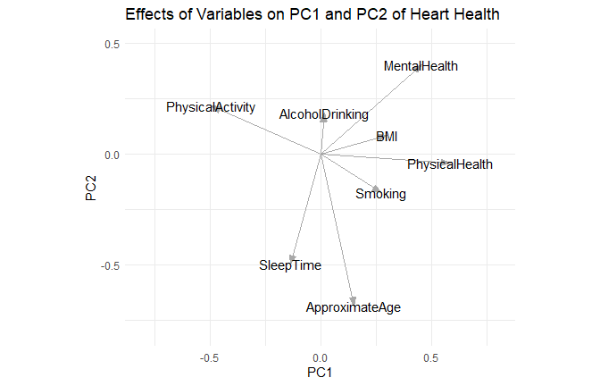<!-- -->

``` r
# Plot % variance explained by PCs
heart_pc_fit %>%
  tidy(matrix = 'eigenvalues') %>% # extract eigenvalues
  ggplot(aes(PC, percent)) + 
  geom_col() + 
  scale_x_continuous(
    # create one axis tick per PC
    breaks = 1:8
  ) +
  scale_y_continuous(
    name = 'variance explained',
    # format y axis ticks as percent values
    label = scales::label_percent(accuracy = 1)
  ) + 
  theme_minimal() +
  ggtitle('Variance of Heart Health Explained by PCs')
```

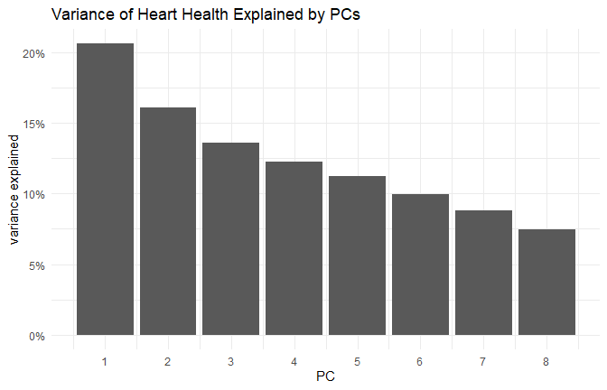<!-- -->

## Q2

Make a scatter plot of PC 2 versus PC 1 and color by heart disease
status. Then use the rotation plot from Problem 1 to describe the
variables/factors by which we can separate the study participants with
heart disease from the study participants without heart disease.

``` r
pct_var = heart_pc_fit %>%
  tidy(matrix = 'eigenvalues') %>%
  filter(PC == 1 | PC == 2) %>%
  select(percent) %>% 
  mutate(percent = percent*100) %>%
  round(digits = 1) %>% 
  as.list() %>% 
  unlist()

heart_pc_fit %>%
  augment(heart_data) %>%                # add model to data
  ggplot(aes(.fittedPC1, .fittedPC2)) +  # plot PC1, PC2
  geom_point(
    aes(color = HeartDisease), 
    shape = 1, alpha = 0.5
    ) +
  labs(
    x = paste0('PC1', ' (', pct_var[1], '%)'), 
    y = paste0('PC2', ' (', pct_var[2], '%)'),
    title = 'Effects of PC1 and PC2 on Heart Health'
    ) +
  theme_minimal() +
  coord_fixed()
```

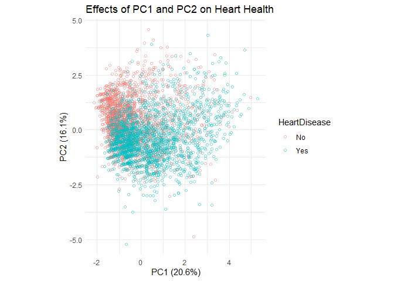<!-- -->

``` r
heart_pc_fit %>%
  tidy(matrix = 'rotation') %>%
  filter(PC == 1 | PC == 2) %>%
  arrange(value) %>%
  slice(1:3) %>%
  mutate(value = round(value, digits = 3)) %>%
  rename(variable = column, contribution = value) %>%
  kable()
```

<table>
<thead>
<tr>
<th style="text-align:left;">
variable
</th>
<th style="text-align:right;">
PC
</th>
<th style="text-align:right;">
contribution
</th>
</tr>
</thead>
<tbody>
<tr>
<td style="text-align:left;">
ApproximateAge
</td>
<td style="text-align:right;">
2
</td>
<td style="text-align:right;">
-0.685
</td>
</tr>
<tr>
<td style="text-align:left;">
SleepTime
</td>
<td style="text-align:right;">
2
</td>
<td style="text-align:right;">
-0.496
</td>
</tr>
<tr>
<td style="text-align:left;">
PhysicalActivity
</td>
<td style="text-align:right;">
1
</td>
<td style="text-align:right;">
-0.492
</td>
</tr>
</tbody>
</table>

*It appears that approximate age, sleep time, and physical activity
contribute most to the effects that the first and second principal
components have on heart health. In general, there does not seem to be a
strict divide between people with and without heart disease, which is
reasonable since the first two principal components only explain \~ 36%
of the variation in heart health.*

*However, it appears that people who are older, sleep more, and are less
physically active report having some kind of heart disease. The
relationships between these three variables make sense, since older
people tend to exercise less and sleep more than younger people.*
