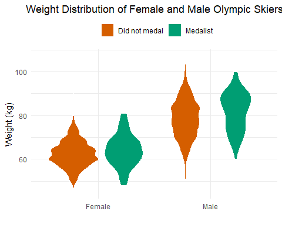
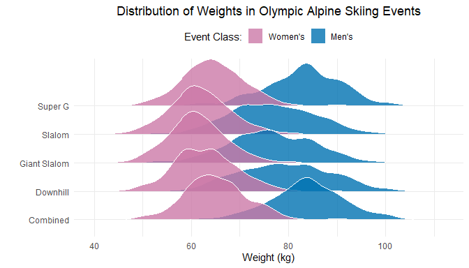
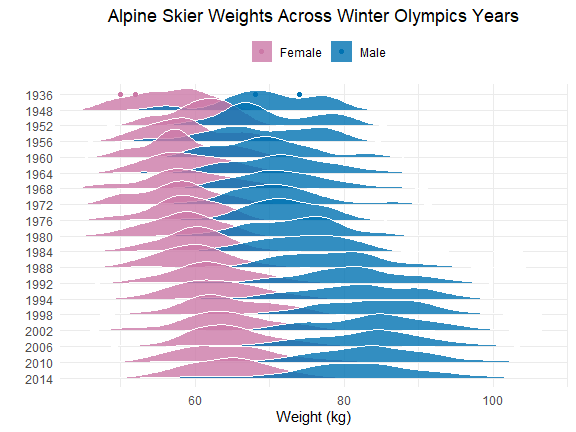

Project 1: Visualizing Distributions of Olympic Skiers
================
Table of Contents

- <a href="#introduction"
  id="toc-introduction"><strong>Introduction</strong></a>
- <a href="#questions" id="toc-questions"><strong>Questions</strong></a>
- <a href="#data-preparation" id="toc-data-preparation"><strong>Data
  preparation</strong></a>
- <a href="#approach" id="toc-approach"><strong>Approach</strong></a>
- <a href="#analysis" id="toc-analysis"><strong>Analysis</strong></a>
- <a href="#discussion"
  id="toc-discussion"><strong>Discussion</strong></a>

# **Introduction**

This analysis is based on a subset of the
[olympics](https://github.com/rfordatascience/tidytuesday/tree/master/data/2021/2021-07-27/readme.md)
data set. Each row of the subset, `olympics_alpine`, describes an event
that was competed by an Alpine Skier at a Winter Olympics between 1936
and 2014. This data set contains a total of 6350 competed events (rows),
describing 1,764 distinct athletes. A total of 17 variables are defined
in this data set, containing athlete information, competition details,
and Winter Olympics meta data. Two of the 17 variables were not in the
initial `olympics` data set, but were added to facilitate analysis and
visualizations.

Information about the six relevant variables (columns) used in this
analysis is provided as follows.

1.  The `sex` variable categories an athlete as female or male.

2.  The `weight` variable is the numerical weight of an athlete in
    kilograms.

3.  The `year` variable categorizes the year of the Winter Olympic
    games, ranging from 1936 to 2014. Years are incremented by 4 with
    the exception of a gap between 1936 and 1948.

4.  The `event` variable categorizes skiing events (i.e., Downhill,
    Super G, Giant Slalom, Slalom, Combined).

5.  The `event_class` variable categorizes an event as ‘Women’s’ or
    ‘Men’s’.

6.  The `medalist` variable is describes whether an athlete received a
    medal for their respective event.

# **Questions**

1.  ***Are there weight differences for male and female Olympic skiers
    who were successful or not in earning a medal?***

2.  ***Are there weight differences for skiers who competed in different
    alpine skiing events?***

3.  ***How has the weight distribution of alpine skiers changed over the
    years?***

# **Data preparation**

``` r
olympics = readr::read_csv('https://raw.githubusercontent.com/rfordatascience/tidytuesday/master/data/2021/2021-07-27/olympics.csv')

olympics_alpine = olympics %>% 
  filter(!is.na(weight)) %>%             # only keep athletes with known weight
  filter(sport == "Alpine Skiing") %>%   # keep only alpine skiers
  mutate(
    medalist = case_when(                # add column describing whether athlete medaled at event 
      is.na(medal) ~ 'Did not medal',    # NA values go to 'Did not medal'
      !is.na(medal) ~ 'Medalist'         # non-NA values (Gold, Silver, Bronze) go to 'Medalist'
    )
  ) %>%
  mutate(
    event_class = case_when(             # add column with event class 
      sex == 'M' ~ 'Men\'s',             # M events are labeled Men's
      sex == 'F' ~ 'Women\'s',           # F events are labeled Women's
    )
  ) %>%
  mutate(
    sex = case_when(                     # re-label sex for nicer legends
      sex == 'F' ~ 'Female',
      sex == 'M' ~ 'Male'
    )
  ) 

# For Q2: 
# Remove redundant Alpine Skiing <Women's/Men's> in event labels
olympics_alpine$event = gsub('Alp.+en\'s', '', olympics_alpine$event)

# For Q3: 
# Re-order years so time increases as you move down y-axis
years_sorted = olympics_alpine %>% select(year) %>% arrange(-year) %>% distinct() 
olympics_alpine$year = factor(olympics_alpine$year, levels = years_sorted$year)

# Athletes from 1936 plotted as points, not densities
data_1936 = olympics_alpine %>% filter(year == '1936') 

# Remaining distinct athletes per year plotted as densities
data_remaining = olympics_alpine %>% distinct(year, id, .keep_all = T)
```

``` r
# Total events
olympics_alpine %>% nrow()
```

    ## [1] 6350

``` r
# Total athletes
olympics_alpine %>% distinct(id) %>% nrow()
```

    ## [1] 1764

``` r
# Distinct events
olympics_alpine %>% distinct(event) 
```

    ## # A tibble: 5 × 1
    ##   event          
    ##   <chr>          
    ## 1 " Downhill"    
    ## 2 " Super G"     
    ## 3 " Giant Slalom"
    ## 4 " Slalom"      
    ## 5 " Combined"

# **Approach**

Violin plots (`geom_violin()`) are an effective way to compare
probability densities across a small number of categorical groups, since
densities can be compared between adjacent groups. Using this reasoning,
a violin plot was chosen to compare weight distributions across female
and male skiers. Additionally, color was used to visualize whether a
difference in weight distributions exists between athletes that may or
may not have won a medal. This was accomplished using
`aes(fill=medalist)`.

Ridgeline plots (`geom_density_ridges`) are an effective way to compare
probability densities across a mid-large number of categorical groups.
Using this reasoning, a ridgeline plot was used to compare weight
differences across the five core skiing events. The class of event
(Women’s vs. Men’s) was also visualized (`aes(fill=event_class)`), since
the distribution of weights is clearly bi-modal based on sex.

Similarly, a ridgeline plot was also used to examine how the weights of
distinct athletes changed across Winter Olympics games from 1936 to
2014. Once again, since the distribution of weights is bi-modal, the
weights of female and male athletes was distinguished using
`aes(fill=sex)`.

# **Analysis**

## Q1

***Are there weight differences for male and female Olympic skiers who
were successful or not in earning a medal?***

This question is addressed by visualizing weight distributions as
violins across each event that a female or male athlete competed in,
distinguished by whether the athlete received a medal at their
respective event.

There is a clear difference between the distribution of weights of
female and male athletes. For both sexes, the weight distribution of
medalists appears to be smoother than the weight distribution of
non-medalists.

``` r
ggplot(olympics_alpine) +
  geom_violin(
    aes(
      x = sex, 
      y = weight, 
      fill = medalist
      ), 
    color = 'white'
    ) +
  labs(
    x = '', 
    y = 'Weight (kg)', 
    fill = '',
    title = 'Weight Distribution of Female and Male Olympic Skiers'
    ) +
  scale_fill_manual(values = c('#D55E00', '#009E73')) +
  theme_minimal() +
  theme(
    plot.title = element_text(hjust = 0.5),
    legend.position = 'top'
    )
```



## Q2

***Are there weight differences for skiers who competed in different
alpine skiing events?***

This question was addressed by visualizing the distribution of athlete
weights across the five core Alpine Skiing events, separated by whether
the event was a Women’s event or a Men’s event.

Generally, weights in Women’s events tend to have consistent
distributions, whereas weights in Men’s events have distributions with
starker differences in shape.

``` r
ggplot(olympics_alpine) +
  geom_density_ridges(
    aes(x = weight, y = event, fill = event_class),
    color = 'white', 
    scale = 1.8, alpha = 0.8, 
    rel_min_height = 0.01
    ) +
  labs(
    x = 'Weight (kg)', 
    y = '', 
    fill = 'Event Class:',
    title = 'Distribution of Weights in Olympic Alpine Skiing Events'
    ) +
  scale_fill_manual(
    values = c('#CC79A7', '#0072B2'), 
    breaks = c('Women\'s', 'Men\'s')
    ) +
  theme_minimal() +
  theme(
    plot.title = element_text(hjust = 0.5),
    legend.position = 'top'
    )
```



## Q3

***How has the weight distribution of alpine skiers changed over the
years?***

This question was addressed by visualizing the distribution of weights
across Winter Olympic years, separated by whether each **distinct**
athlete was male or female. For 1936, there is only information for four
athletes, so weight data points were visualized rather than weight
density.

There appears to be a slight increase in weights in recent Winter
Olympic years in both female and male athletes. Additionally, there is a
larger spread of weights across both sexes in recent years.

``` r
ggplot() + 
  # Weights of athletes from 1948-2014
  geom_density_ridges(
    aes(
      x = data_remaining$weight, 
      y = data_remaining$year, 
      fill = data_remaining$sex
      ),
    col = 'white', 
    scale = 1.8, 
    alpha = 0.8, 
    rel_min_height = 0.01
    ) +
  # Weights of 1936 athletes
  geom_point(
    aes(
      x = data_1936$weight, 
      y = data_1936$year, 
      col = data_1936$sex)
    ) +
  xlim(
    min(data_remaining$weight), 
    max(data_remaining$weight)
    ) +
  labs(
    x = 'Weight (kg)', 
    y = '', 
    fill = '', 
    color = '',
    title = 'Alpine Skier Weights Across Winter Olympics Years'
    ) +
  scale_fill_manual(values = c('#CC79A7', '#0072B2')) +
  scale_color_manual(values = c('#CC79A7', '#0072B2')) +
  theme_minimal() +
  theme(
    plot.title = element_text(hjust = 0.5),
    legend.position = 'top'
    )
```



# **Discussion**

## Q1

***Are there weight differences for male and female Olympic skiers who
were successful or not in earning a medal?***

Weight differences across medalists and non-medalists appear to minimal
compared to weight differences across female and male athletes. Within
sexes, the weights of medalists/non-medalists are similarly distributed,
indicated by similarly shaped violins. Across sexes, male weights are
vertically shifted relative to female weights, indicating that male
athletes are heavier than females on average, as expected.

*Note: This plot may be slightly misrepresenting the question being
asked, since some athletes compete in several events across several
Winter Olympics, meaning that their weight is included as repeated data
points (assuming an athlete’s weight stays somewhat constant through
time). This is unavoidable, since `medalist` describes whether an
athlete medaled at a **unique** event at a **unique** Winter Olympics.*

## Q2

***Are there weight differences for skiers who competed in different
alpine skiing events?***

Female athlete weights across all five Women’s events have similarly
shaped distributions centered around \~60-65 kg within a consistent
range of weights (\~45-85 kg).

Male athlete weights across Men’s Slalom, Giant Slalom, and Downhill
events have similarly shaped distributions centered around \~75-80 kg
and have heavier tails of lighter-weight men compared to Super G and
Combined events. Generally, male weights for Super G and Combined have
similarly shaped distributions centered around \~83 kg and have smaller
variances indicated by a larger peak.

## Q3

***How has the weight distribution of alpine skiers changed over the
years?***

Although weight appears to slightly increase through recent Winter
Olympic years, it is important to consider that earlier data sets are
sparsely populated. For example, 1936 has 4 athlete weights and 1948 and
1952 each have 19 athlete weights, etc. Data sets from 1992 onward have
more than 200 athlete weights, which likely reflects why we see larger
spreads of weights across female and male athletes in recent years.
