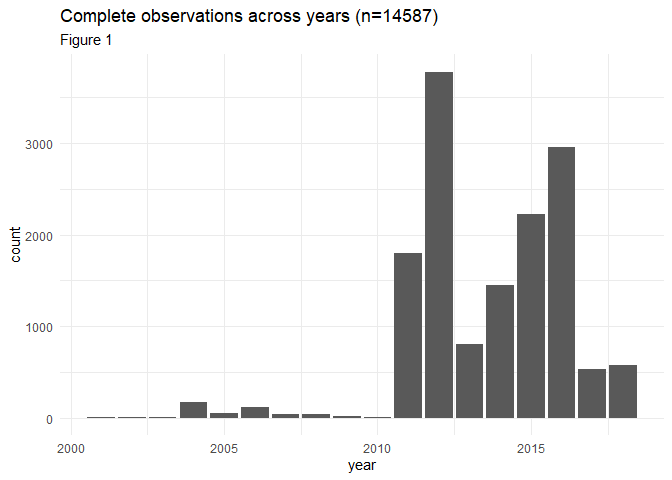
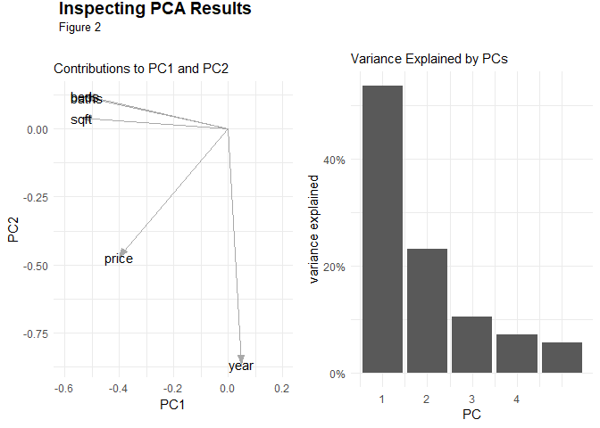
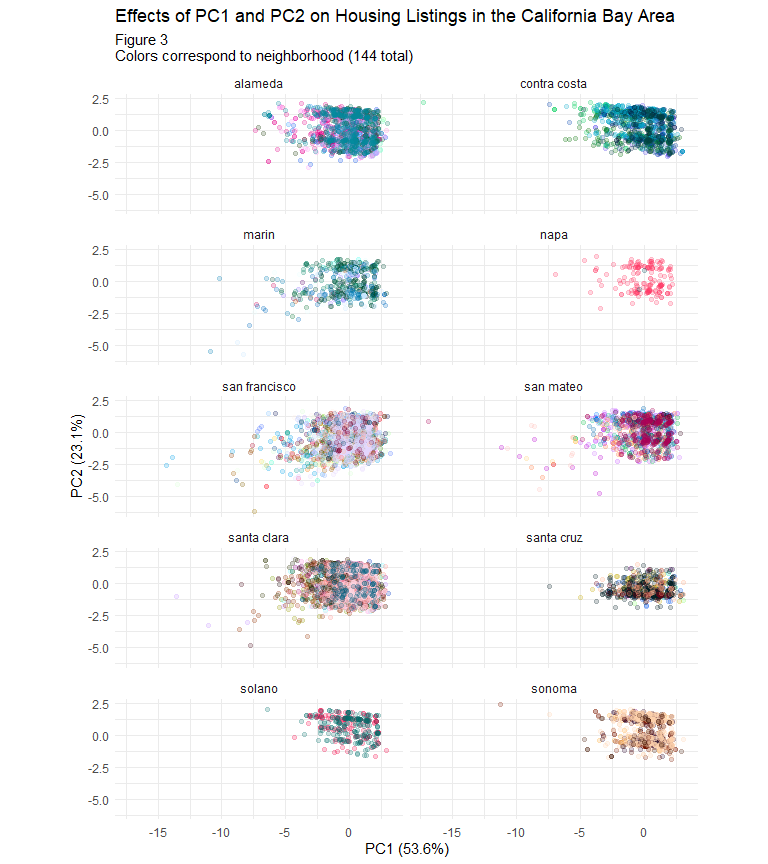

Project 3: Dimensionality Reduction of Bay Area Rental Prices
================
Table of Contents

- <a href="#introduction"
  id="toc-introduction"><strong>Introduction</strong></a>
- <a href="#question" id="toc-question"><strong>Question</strong></a>
- <a href="#data-preparation" id="toc-data-preparation"><strong>Data
  preparation</strong></a>
- <a href="#approach" id="toc-approach"><strong>Approach</strong></a>
- <a href="#analysis" id="toc-analysis"><strong>Analysis</strong></a>
- <a href="#discussion"
  id="toc-discussion"><strong>Discussion</strong></a>

# **Introduction**

The data set examined in this analysis (`rents`) describes rental
housings listed on Craigslist in the California Bay Area from 2000-2018.
Each row in the data set represents a listing on Craiglist. Information
about the five relevant variables (columns) used in this analysis is
provided as follows:

1.  `year` is the year that the listing was advertised.
2.  `nhood` describes the neighborhood that the rental unit is located
    in.
3.  `county` describes the county that the rental unit is located in.
4.  `price` describes the monthly rent in USD.
5.  `beds` describes the number of bedrooms in the unit.
6.  `baths` describes the number of bathrooms in the unit.
7.  `sqft` describes the unit’s square footage.
8.  `room_in_apt` describes whether the listing refers to an entire unit
    (`0`) or a bedroom in a unit (`1`).

# **Question**

***To what extent can year, rental price, number of beds and baths, and
square footage distinguish the location of the rental unit?***

# **Data preparation**

``` r
rents = readr::read_csv('https://raw.githubusercontent.com/rfordatascience/tidytuesday/master/data/2022/2022-07-05/rent.csv')
```

More information about the dataset can be found on the Tidy Tuesday
[repository](https://github.com/rfordatascience/tidytuesday/blob/master/data/2022/2022-07-05/readme.md).

# **Approach**

A principal component analysis (PCA) was performed to analyze whether a
listing’s location can be distinguished by year, rental price, number of
beds and baths, and square footage. Performing PCA can provide a
succinct way to visualize multidimensional data sets, and can help
collapse dimensions that do not add additional information to the
identity of the observations.

After computing the principal components (PCs), the eigenvectors of the
five variables were plotted to help visualize how each variable
contributes to an observation’s localization on the first two PCs.
Additionally, a bar plot was used to visualize the percent variance
explained by each PC. Lastly, the listing observations were plotted on
the coordinates of the first two PCs and faceted by county to identify
if any visual clusters characterized listings in a particular county.

# **Analysis**

Before beginning any analysis, I removed any listings that referred to
rooms in an apartment in order to only keep listings for entire units.
Additionally, I removed rows that were missing information about
`price`, `beds`, `baths`, or `sqft`.

``` r
rents_clean = rents %>% 
  filter(room_in_apt == 0) %>%
  drop_na(price, beds, baths, sqft) 
```

Along with data cleaning, I also wanted to inspect how the number of
listings varied through time (between 2001-2018) after the filtering
performed above. Figure 1 supports that there is a low number of
complete listings prior to 2011. For this reason, the remaining analysis
will focus on years 2011-2018.

``` r
n_listings = nrow(rents_clean)
title = paste0('Complete observations across years', ' (n=', n_listings, ')')

rents_clean %>%
  ggplot() +
  geom_bar(aes(x = year)) +
  labs(title = title, subtitle = 'Figure 1') +
  theme_minimal()
```

<!-- -->

``` r
rents_subset = rents_clean %>% 
  filter(year >= 2011) %>% 
  select(year, price, beds, baths, sqft)
```

To prepare for PCA, the five numeric attributes mentioned prior were
scaled to have a mean of zero and unit variance.

``` r
# Perform PCA, save model.
rents_pc_fit = rents_subset %>%
  select(where(is.numeric)) %>% # select numeric columns
  scale() %>%                   # scale to mean=0, var=1
  prcomp()                      # perform PCA
```

The code below visualizes the eigenvectors localized on the first two
PCs, and the percent variance explained by each PC.

``` r
# Arrow styling code from Dr. Wilke's dimension-reduction-1 slides:
arrow_style = arrow(
  angle = 20, length = grid::unit(8, 'pt'),
  ends = 'first', type = 'closed'
)

# Plot rotation of PC1 and PC2
plot_rotation = rents_pc_fit %>%
  tidy(matrix = 'rotation') %>% 
  pivot_wider(                  
    names_from = 'PC', 
    values_from = 'value',
    names_prefix = 'PC'
  ) %>%
  ggplot(aes(PC1, PC2)) +
  geom_segment(
    xend = 0, 
    yend = 0,
    arrow = arrow_style,
    col = 'dark grey'
    ) +
  geom_text(
    aes(label = column), 
    hjust = 0.5
    ) +
  xlim(-0.6, 0.2) +
  coord_fixed() +
  theme_minimal() +
  labs(subtitle = 'Contributions to PC1 and PC2') 

# Plot % variance explained by PCs
plot_var = rents_pc_fit %>%
  tidy(matrix = 'eigenvalues') %>%
  ggplot(aes(PC, percent)) + 
  geom_col() + 
  scale_x_continuous(breaks = 1:4) +
  scale_y_continuous(
    name = 'variance explained',
    label = scales::label_percent(accuracy = 1)
  ) + 
  theme_minimal() +
  labs(subtitle = 'Variance Explained by PCs') +
  theme(plot.title = element_text(hjust = 0.5))

# Combined plot
combined_plots = plot_grid(plot_rotation, plot_var)
combined_title = ggdraw() + 
  draw_label(
    'Inspecting PCA Results', 
    fontface = 'bold', 
    x = 0, 
    y = 1, 
    hjust = 0
    ) +
  draw_label(
    'Figure 2', 
    fontface = 'plain', 
    size = 10,
    x = 0, 
    y = 0.5, 
    hjust = 0
    ) +
  theme(plot.margin = margin(0, 0, 0, 50))

plot_grid(
  combined_title, 
  combined_plots,
  ncol = 1, 
  rel_heights = c(0.1, 1)
  ) +
  theme(plot.margin = margin(6, 0, 0, 0))
```

<!-- -->

Next, the listing observations were plotted on the coordinates of the
first two PCs, faceted by county, and colored by neighborhood.

``` r
# will be used to append original data to PCs
rents_w_name = rents_clean %>% filter(year >= 2011)

# number of neighborhoods
# (used to generate palette at from http://medialab.github.io/iwanthue/)
num_nhoods = rents_w_name %>% distinct(nhood) %>% nrow()
nhood_palette = read.csv('palette_i_want_hue.csv', header = F)

# % variance explained labels
pct_var = rents_pc_fit %>%
  tidy(matrix = 'eigenvalues') %>%
  filter(PC == 1 | PC == 2) %>%
  select(percent) %>% 
  mutate(percent = percent*100) %>%
  round(digits = 1) %>% 
  as.list() %>% 
  unlist()

# PC1 & PC2 faceted by county, colored by neighborhood.
rents_pc_fit %>%
  augment(rents_w_name) %>%  
  drop_na(county) %>%
  ggplot(aes(.fittedPC1, .fittedPC2)) + 
  geom_point(
    aes(col = nhood), 
    alpha = 0.2
    ) +
  labs(
    x = paste0('PC1', ' (', pct_var[1], '%)'),
    y = paste0('PC2', ' (', pct_var[2], '%)'),
    title = 'Effects of PC1 and PC2 on Housing Listings in the California Bay Area',
    subtitle = 'Figure 3\nColors correspond to neighborhood (144 total)'
    ) +
  scale_color_manual(values = nhood_palette$V1) +
  facet_wrap(
    ~county, 
    nrow = 5
    ) +
  coord_fixed() +
  theme_minimal() + 
  theme(legend.position = 'none')
```

<!-- -->

# **Discussion**

Based on the eigenvectors in Figure 2, the majority of the variance of
PC1 and PC2 can be explained by the year that the listing was posted and
the square footage, supported by the orthogonality of the two
eigenvectors. Additionally, Figure 2 supports that number of beds and
baths provide redundant information in the first two PCs. Figure 2 also
supports that the first two PCs account for approximately 76% of the
variation in listings.

In Figure 3, we see that the county that a listing corresponds to is not
easily distinguished by the five variables analyzed. The listings were
subsequently colored by neighborhood in an attempt to parse out smaller
differences in location. None of the counties have neighborhoods with
one obviously distinguishable type of listing. Thus, it appears that Bay
Area neighborhoods have a wide variety of listing characteristics, which
may be an encouraging feature that encourages a broad range of rental
applicants.
